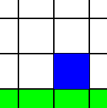
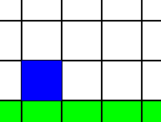

<!-- red = #f8312e -->
<!-- green = #00d369 -->
<!-- orange = #ffb02f -->
<!-- blue = #00a5ed -->
<!-- 🟥🟩🟨🟦 -->

# Mario Bros Game 

🟩🟥🟦🟨🟩🟥🟦🟨🟦🟥🟨🟩

 

A simplifier version fo the famous game Mario Bros with an AI (Reinforcement Learning algorithm && MCTS) that will learn how to complete a custom level of the game.

 

# Rules 

🟦🟦🟦🟦

Here is an example of a map.

🟦 Player 🟩 Block 🟨 Coin 🟥 Finish

The aim of the game is simple: reach the finish line as quickly as possible by collecting the coins.

To do this, the player has 2 actions at his disposal :

- Go right 
- Jump 

 

## Go right 

🟩🟩🟩🟩🟩

### Without block 

🟨🟨🟨🟨🟨🟨

|               |              |
| :------------------------------------------------------------------------------: | :-----------------------------------------------------------------------------: |
| Before | After |

### With block 

🟨🟨🟨🟨🟨

|                     |                    |
| :------------------------------------------------------------------------------: | :-----------------------------------------------------------------------------: |
| Before | After |

### With hole 

🟨🟨🟨🟨🟨

|                       |                      |
| :------------------------------------------------------------------------------: | :-----------------------------------------------------------------------------: |
| Before | After |

 

## Jump 

🟩🟩🟩

### Without block 

🟨🟨🟨🟨🟨🟨

|                    |                |                   |
| :------------------------------------------------------------------------------: | :--------------------------------------------------------------------------: | :-----------------------------------------------------------------------------: |
| Before | In | After |

### With block down 

🟨🟨🟨🟨🟨🟨🟨🟨

|                |            |               |
| :------------------------------------------------------------------------------: | :--------------------------------------------------------------------------: | :-----------------------------------------------------------------------------: |
| Before | In | After |

### With block up 

🟨🟨🟨🟨🟨🟨

|                    |                |                   |
| :------------------------------------------------------------------------------: | :--------------------------------------------------------------------------: | :-----------------------------------------------------------------------------: |
| Before | In | After |

### Stairway 

🟨🟨🟨🟨

|                    |                |                   |
| :------------------------------------------------------------------------------: | :--------------------------------------------------------------------------: | :-----------------------------------------------------------------------------: |
| Before | In | After |

 

# Gameplay 

🟦🟦🟦🟦🟦🟦🟦

 

# Report 

🟦🟦🟦🟦🟦

You can find the project report in French [here](https://github.com/H4znow/marioBrossGame/blob/main/report/report.pdf).
